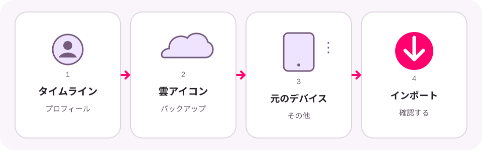

# Google マップのタイムラインを復元する

[English](restore-google-maps-timeline.md) · [한국어](restore-google-maps-timeline.ko.md)

機種変更、Google マップの再インストール、端末の初期化後に以前の移動履歴が
表示されない場合は、暗号化されたタイムラインのバックアップを Google マップへ
インポートできることがあります。

バックアップの復元と JSON ファイルの読み込みは別の操作です。タイムライン可視化は
Google アカウントや暗号化されたバックアップにアクセスできません。最初に Google
マップで履歴を復元し、その後に新しい Timeline JSON ファイルを書き出してください。

この画像は Google マップのスクリーンショットではなく、操作を簡略化した図です。
アプリのバージョン、端末、言語によって項目名や配置が異なる場合があります。

## 始める前に

- Google マップを最新版に更新し、以前の端末で使用したアカウントでログインします。
- 元の端末でタイムラインのバックアップが有効になっている必要があります。
  バックアップは端末ごとに有効にします。
- 最近の変更がバックアップへ反映されるまで数日かかる場合があります。
- バックアップが作成されていなかった場合、削除されたデータをこの手順で復元する
  ことはできません。

## Google マップでバックアップをインポートする

1. **Google マップ**を開きます。
2. プロフィール写真またはアカウントのイニシャルをタップし、**タイムライン**を選びます。
3. 右上の雲またはバックアップのアイコンをタップします。
4. **バックアップ**から、以前のタイムラインが保存されている端末を選びます。
5. **その他**を開き、**インポート**を選びます。
6. 確認画面でもう一度 **インポート**を選びます。

続行する前に、以前の訪問履歴が Google マップに表示されることを確認してください。

## タイムライン可視化で使う JSON を書き出す

Android では **端末の設定 → 位置情報 → 位置情報サービス → タイムライン →
タイムライン データのエクスポート**を開きます。JSON ファイルを保存して
タイムライン可視化へ戻り、**新しい動画**を開いて**ファイルを選択**を選びます。

iPhone または iPad では **Google マップ → プロフィール写真 → 設定 →
個人的なコンテンツ → タイムライン データのエクスポート**を使用します。
ファイルを保存し、タイムライン可視化を使用する Android 端末へ移動してください。

Google マップのバックアップを復元しても、JSON ファイルがタイムライン可視化へ
自動的に送られることはありません。

## バックアップが見つからない、またはロックされている場合

- 復元を試している間は既存のバックアップを削除しないでください。
- 雲アイコン、元の端末、**インポート**が表示されない場合は、Google の最新の
  公式説明を確認してください。
- 暗号化されたデータがロックされているというメッセージが表示された場合は、
  Google の復旧手順に従ってください。最初に暗号化した端末が必要な場合があります。
- タイムライン可視化は Google のバックアップを確認、解除、修復できません。

公式の説明:

- [Android 用 Google マップ タイムライン ヘルプ](https://support.google.com/maps/answer/6258979?hl=ja&co=GENIE.Platform%3DAndroid)
- [iPhone と iPad 用 Google マップ タイムライン ヘルプ](https://support.google.com/maps/answer/6258979?hl=ja&co=GENIE.Platform%3DiOS)

この独立した説明は、2026年8月18日に Google のヘルプページと照合しました。
タイムライン可視化は Google と提携しておらず、Google の承認を受けたものではありません。
