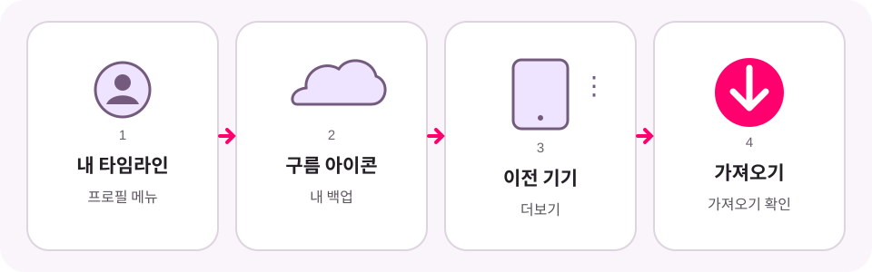

# Google 지도 타임라인 복원하기

[English](restore-google-maps-timeline.md) · [日本語](restore-google-maps-timeline.ja.md)

휴대전화를 바꾸거나 Google 지도를 다시 설치한 뒤 이전 이동 기록이 보이지 않는다면,
Google 지도에서 암호화된 타임라인 백업을 가져올 수 있습니다.

백업 복원과 JSON 파일 불러오기는 서로 다른 단계입니다. 타임라인 비주얼라이저는
Google 계정이나 암호화된 백업에 접근할 수 없습니다. 먼저 Google 지도에서 이동
기록을 복원한 뒤 새로운 Timeline JSON 파일을 내보내세요.

위 이미지는 Google 지도 화면을 그대로 캡처한 것이 아니라 단계를 단순화한 도식입니다.
앱 버전, 기기, 언어에 따라 메뉴 이름과 배치가 다를 수 있습니다.

## 시작하기 전에

- Google 지도를 최신 버전으로 업데이트하고 이전 기기에서 사용한 계정으로 로그인합니다.
- 이전 기기에서 타임라인 백업이 켜져 있어야 합니다. 백업은 기기마다 따로 켜야 합니다.
- 최근 변경된 타임라인이 백업에 반영되기까지 며칠이 걸릴 수 있습니다.
- 생성된 백업이 없다면 삭제된 타임라인을 이 방법으로 되살릴 수 없습니다.

## Google 지도에서 백업 가져오기

1. **Google 지도**를 엽니다.
2. 프로필 사진 또는 계정 이니셜을 누르고 **내 타임라인**을 선택합니다.
3. 오른쪽 위의 구름 또는 백업 아이콘을 누릅니다.
4. **내 백업**에서 이전 타임라인이 들어 있는 기기를 선택합니다.
5. **더보기**를 열고 **가져오기**를 선택합니다.
6. 확인 화면에서 **가져오기**를 다시 누릅니다.

계속하기 전에 Google 지도에서 이전 이동 기록이 표시되는지 확인하세요.

## 타임라인 비주얼라이저용 JSON 내보내기

Android에서는 **휴대전화 설정 → 위치 → 위치 서비스 → 타임라인 → 타임라인 데이터
내보내기**로 이동합니다. JSON 파일을 저장한 뒤 타임라인 비주얼라이저로 돌아와
**새 영상**을 열고 **파일 선택**을 누릅니다.

iPhone이나 iPad에서는 **Google 지도 → 프로필 사진 → 설정 → 개인 콘텐츠 → 타임라인
데이터 내보내기**를 사용합니다. 파일을 저장한 뒤 타임라인 비주얼라이저를 실행할
Android 기기로 옮기세요.

Google 지도 백업을 복원해도 JSON 파일이 타임라인 비주얼라이저로 자동 전송되지는 않습니다.

## 백업이 보이지 않거나 잠겨 있을 때

- 복원을 시도하는 동안 기존 백업을 삭제하지 마세요.
- 구름 아이콘, 이전 기기, **가져오기**가 보이지 않으면 아래 Google 공식 안내를 확인하세요.
- 암호화된 데이터가 잠겼다는 메시지가 나오면 Google의 복구 절차를 따르세요. 백업을
  처음 암호화한 기기가 필요할 수 있습니다.
- 타임라인 비주얼라이저는 Google 백업을 확인하거나 잠금 해제 또는 복구할 수 없습니다.

공식 안내:

- [Android용 Google 지도 타임라인 도움말](https://support.google.com/maps/answer/6258979?hl=ko&co=GENIE.Platform%3DAndroid)
- [iPhone 및 iPad용 Google 지도 타임라인 도움말](https://support.google.com/maps/answer/6258979?hl=ko&co=GENIE.Platform%3DiOS)

이 독립 안내는 2026년 8월 18일 Google 도움말을 기준으로 확인했습니다. 타임라인
비주얼라이저는 Google과 제휴하지 않았으며 Google의 보증을 받지 않았습니다.
