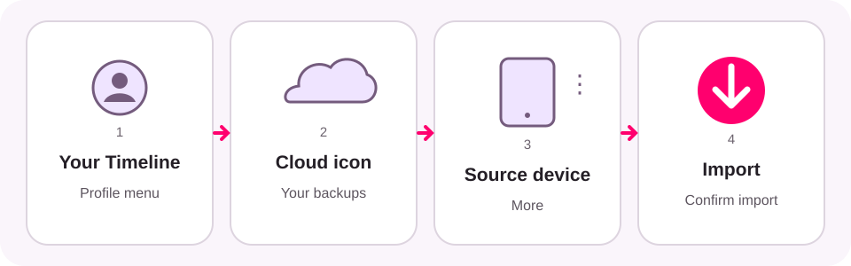

# Restore Google Maps Timeline

[한국어](restore-google-maps-timeline.ko.md) · [日本語](restore-google-maps-timeline.ja.md)

If older trips are missing after changing phones, reinstalling Google Maps, or
resetting a device, you may be able to import an encrypted Timeline backup into
Google Maps.

Restoring a backup and loading a JSON file are separate steps. Timeline Visualizer
cannot access your Google account or encrypted backup. Restore the history in
Google Maps first, then export a new Timeline JSON file.

The image is a simplified guide, not a Google Maps screenshot. Labels and layout
can vary by app version, device, and language.

## Before you start

- Update Google Maps and sign in with the account used on the previous device.
- Timeline backup must have been enabled on the source device. Google requires
  backup to be enabled separately on each device.
- Recent Timeline changes can take several days to appear in a backup.
- If no backup was created, this guide cannot recreate deleted Timeline data.

## Import the backup in Google Maps

1. Open **Google Maps**.
2. Select your profile picture or account initial, then **Your Timeline**.
3. Select the cloud or backup icon in the upper-right corner.
4. Under **Your backups**, select the device that contains the older Timeline.
5. Open **More**, then select **Import**.
6. On the confirmation screen, select **Import** again.

Confirm that your older visits are visible in Google Maps before continuing.

## Export a JSON file for Timeline Visualizer

On Android, open **Phone Settings → Location → Location services → Timeline →
Export Timeline data**. Save the JSON file, return to Timeline Visualizer, and
open **New video** and select **Choose file**.

On iPhone or iPad, open **Google Maps → profile picture → Settings → Personal
content → Export Timeline data**, save the file, then move it to the Android
device running Timeline Visualizer.

Restoring the Google Maps backup does not automatically send a JSON file to
Timeline Visualizer.

## If the backup is missing or locked

- Do not delete a backup while trying to recover it.
- If the cloud icon, source device, or **Import** action is missing, follow
  Google's current instructions for your platform.
- If Google Maps says encrypted data is locked, use Google's recovery instructions.
  They may require access to the device that originally encrypted the backup.
- Timeline Visualizer cannot diagnose, unlock, or repair a Google backup.

Official instructions:

- [Google Maps Timeline Help for Android](https://support.google.com/maps/answer/6258979?hl=en&co=GENIE.Platform%3DAndroid)
- [Google Maps Timeline Help for iPhone and iPad](https://support.google.com/maps/answer/6258979?hl=en&co=GENIE.Platform%3DiOS)

This independent guide was checked against Google's help pages on 18 August 2026.
Timeline Visualizer is not affiliated with or endorsed by Google.
